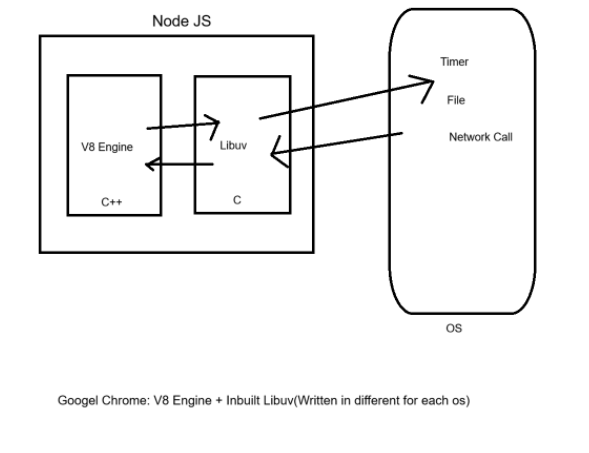

NodeJS = V8 Engine(C++) + Libuv (C language)

Libuv are written on c language to talk with os so that v8 Engline talk with libuv and then libuv talk to get access from os. 




```js
fs.readFile("./data.json", "utf-8", (err, res) => {
    console.log(res);
});  // JS delegates this code to libuv (Thread Pool)

setTimeout(() => {
    console.log("Hello Time out");
}, 3000); // JS delegates this code to libuv (Timer Queue)

```