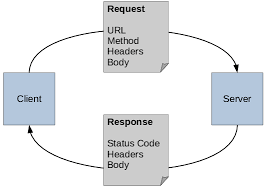

#### HTTP
HTTP (Hyper Text Transfer Protocol) is a **communication protocol used for data exchange between a client and server** over the internet.

-> Http defines how data is requested and how data is sent back.
Hypertext-> Text with link(Web pages,HTML)
Transfer-> Sending data
Protocol-> Set of rules

HTTP: Rules for transferring web data.



Http can actually transfer HTML pages,json(APIs),images,Videos,css/js files.

###### HTTP Method

Http method also called http verb tells the server **what action the client wants to perform** on a resource.

In short instruction given by to the server


1. Get 
    Fetch the data from server.

    ```
        GET /users/1
    ```

2. POST
    Send Data to Server. Create a new Resource.

    ```
        POST /users
    ```
    Contains request.

3. PUT
    Update an Existing resources. Replace entire resource
    
    ```
        PUT /users/1
    ```

4. PATCH
    Update partially to a resource. Updates only specific fields.
    
    ```
        PATCH /users/1
    ```

5. DELETE
    Remove a resource
        ```
            DELETE /users/1
        ```
    
Note: Put updates/replace entire and patch updates only specific fields
Idempotent: Same request many time -> Same result
    GET,DELETE,PATCH,PUT

Non-Idempotent: Same request -> different result
    POST