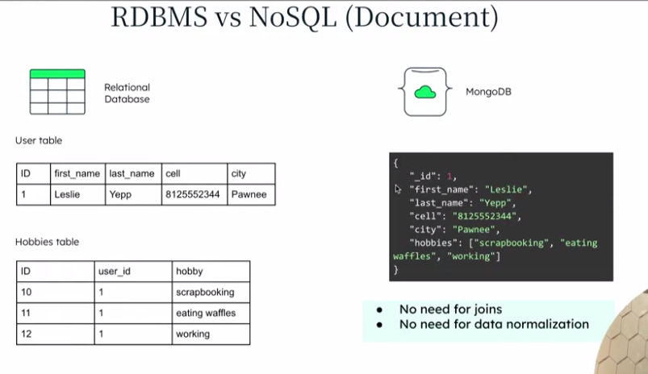

## Database
    Database is an organized collection of data.

## DBMS
    It is **software that interacts with end users, application**, and the database itself to capture and analyze the data.

Why Excel sheet not DBMS
No primary key,multiple user not allowed, Risky in multiuser **No Schema.**

**Why we not store the video and image in db**
* Storing large binaries makes:
    * Queries slow
    * Indexes heavy
    * Storage expensive.

jb bade bade file honge tou for example in secondary storage aur jb mai usko ram me laaunga chuki size bda hai tou ek baar me 2-3 hi record ko compare kr paaunga. time consuming right.

**Database are optimized for structured data**, not large binary file like videos. 
* Affects db performance, scalability, backups.
* We store in object storage and keep only metadata(link) in database.

So store videos in File Storage/Object Storage like aWS s3

### Semistructure data:
    
    Data: metadata+actual data
    Metadata -> Structured format.(video length,Quality,date,title)-> We can store

    actual data-> Unstructured.

## SQL vs NoSQL

**SQL**
* It enforces consistency over avalability.
* Sql we can do normalization to save redundant data.
* We split the data and assign create primary key on table1 and for foreign key in table 2.
* we are joining table.
* No array facilities(We can't create Hobbie1,Hobbie2...)
* It follows ACID property(transaction, bank)
* Difficulties in horizonatal scaling.
    Because in this as we have splited the table and hamlog dono table ko bahut dur dur ke server me rakhenge phir join krne me dikat ho jaayega.(so join is costly) hence horizonatal scaling is difficult. Time consuming.

**NO SQL:** Full form:**Not only sql**
No need for joins.
No need of normalization.

* It enforces flexible schemas, scalability, and high performance applications.
* No-Sql is scalability-first while sql is ACID-first.
* It support vertical and horizontal scaling 
Don't gurantee ACID.

#### Scaling
It means increasing a database's capacity to handle more data,users, or request as application grows.

1. Vertical Scaling: Adding more resources in same machine/server.
2. Horizonal Scaling: Adding more machine/srver.

After one point it become difficult for vertical scaling what if i installed 10crore tb hdd in same machine, It would not be able to manage.

Definition: Sql databases are relational with fixed schemas and strong consistency, while NoSql database are non-relational, schema-flexible and optimized for scalability and performance.

Example: Amazon
* Orders & Payments -> SQL
* Product catalog & recommendations -> NoSQL

#### Sharding
Sharding is horizontal scaling technique where a database is spit into smaller parts across multiple servers to handle large data and high traffic efficiently.

### Replica
Replica means keeping multiple copies (replicas) of same database data on different severs.

High availability, Faster reads(load nhi badhega), Backup & disaster recovery.

**Loadbalancer:** It ensures that not any particular server got so much of request.

**Challenges of Replica:** To be in sync.

* Whenever write/read then sql do this update in master to reduce inconsistency.

* In sql transaction it should lock transaction.
* In NoSql (Social media) it is not risky it does not lock the read/write. 
