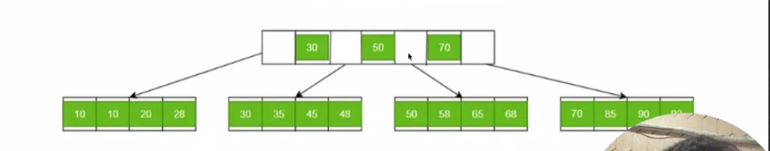

## Mongodb Internal Implementation

In mongodb if data is sorted what is t.c of searching data.

Answer is Binary Search (log(n)). A big no. 
Because in array all are contiguous so it calculate in O(log n)

* Because document data will be 2,3,1,4,... bytes

#### During insertion
Sorted -> O(n)(Searching)+ O(n)(shifting) = O(n)
Unsorted -> O(1)

Similarly in update, search, remove
Sorted -> O(n)
Unsorted -> O(1)

***All Waste***

### Solution?
**Indexing is the solution.**

    id    Physical address
 0  10 -> 1000
 1  12 -> 1002
 2  14 -> 1005
 3  19 -> 1012

   Now (log(n)) time 

We do not need to store the ssd in sorted form. We only need to find empty space i will insert it. We will take id as and memory address and store in indexing array. 

-> Until now when we want to insert the on indexing array it take o(log(n)) to search but to make the space to insert we have to shift in O(n)

**Solution Then to reduce t.c**
***Yes right Tree particularly AVL tree self balancing***

* Each operation in log(n) time.

But until then we do not take AVL tree for indexing.

#### Block Concept
Why we use B+ tree? 
Concept is when we transfer data from hdd to ram then it will not read in hard disk itself 30 byte but whole block will be transfer to ram that is may be 4KB.

-> In avl when we transfer data from ssd to ram then it will fetch 4 kb and we use only 40 byte.

-> And the fetching operation each time is very  costly. So why not store the indexes as Contiguous meaningful data. 
-> So we do not need to waste the time of fetching data from ssd to ram.

* I want to **create whole 4kb byte meaningful** so that **costly i/o operation** can be saved.

#### B+ Tree 
Only leaf node contains where is the data in ssd. Internal node only tells how to reach to that position

* **B+ Tree are very efficient in range queries** operation because leaf node point to next sibling node.
    Hence give the data continuously we do not need to go again and again to the root. 

Ex we need to find id b/w 28 to 34 then it go to 28 and take whole till 34

**B vs B+ Tree**
In B tree each internal data point to actual data in ssd.
Range queries not supported. 

